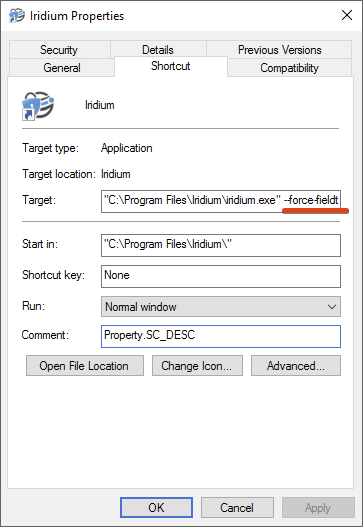

### Fix #1 - Instructions #
**1** Download latest Iridium Browser v54.0 at https://iridiumbrowser.de/downloads/    
**2** BEFORE you install, delete shortcuts to Iridium Browser i.e. from desktop, taskbar, etc.     
**3** Install Iridium Browser (‘iridiumbrowser-latest-x64.msi’ for 64-bit or ‘iridiumbrowser-latest-x86.msi’ for 32-bit)     
**4** Add any shortcuts to i.e. desktop or taskbar, if you would like to start Iridium Browser from a different location than the start menu.     
     
### Fix #2 - Instructions #
(as described on Git https://github.com/iridium-browser/tracker/issues/128)     
**1** Go to the Iridium Browser shortcut in the start menu and right click to open properties window.     
**2** Add the following flag to the end of the ‘Target’ (see screenshot below)     

		--force-fieldtrials=*EnforceCTForProblematicRoots/Disabled/

**3** Repeat this step for all other shortcuts on desktop, in taskbar, etc.     

